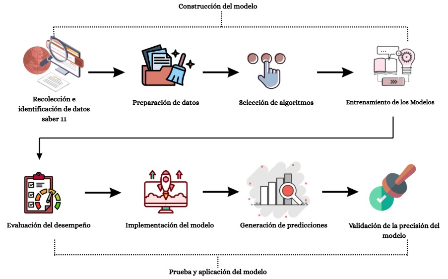

# Aplicación del Machine Learning para la predicción del puntaje en la prueba Saber 11

Investigación académica orientada al desarrollo de un modelo de *machine learning* para predecir el desempeño de estudiantes del Valle del Cauca en la prueba Saber 11, a partir de variables académicas y sociodemográficas.

## Tabla de contenido

- [1. Planteamiento del problema](#1-planteamiento-del-problema)
- [2. Justificación](#2-justificación)
- [3. Objetivos](#3-objetivos)
- [4. Metodología](#4-metodología)
- [5. Resultados](#5-resultados)
- [6. Estado del proyecto](#6-estado-del-proyecto)
- [7. Estructura del proyecto](#7-estructura-del-proyecto)

## 1. Planteamiento del problema

Según datos del ICFES en Colombia solo el 20 % de estudiantes de estrato 1 y 2 con desempeño bajo en la prueba saber 11 accedió a la educación superior en 2022, evidenciando que factores sociodemográficos, económicos y el rendimiento académico histórico del estudiante actúan como barreras estructurales que perpetúan la desigualdad en el acceso a mejores oportunidades de vida. (ICFES, 2025).

Esta problemática se refleja de manera particular también en el Valle del Cauca, donde el 26,6% de la población se encontraba en condición de pobreza monetaria para el año 2023 (DANE 2024), esto representa aproximadamente 1.231.000 personas, una realidad que impacta directamente las condiciones en que los estudiantes acceden al sistema educativo y afrontan pruebas de alto impacto como las Saber 11.  Las instituciones educativas, en su mayoría, carecen de mecanismos basados en datos que logren identificar con anticipación a los estudiantes que están en riesgo de bajo rendimiento, limitando la posibilidad de intervenir a tiempo en actividades pedagógicas oportunas. 

Frente a este panorama surge la siguiente pregunta de investigación: 
> ¿Cómo diseñar un modelo de *machine learning* capaz de predecir el puntaje en la prueba Saber 11 de estudiantes del Valle del Cauca, a partir de variables académicas y sociodemográficas?

## 2. Justificación

Obtener una predicción confiable sobre el rendimiento de los estudiantes en las Pruebas Saber 11 se convierte en una herramienta de alto valor tanto para las instituciones educativas como para los propios estudiantes, ya que permite identificar patrones que contribuyan a reducir las brechas educativas, especialmente aquellas que afectan a las poblaciones más vulnerables del Valle del Cauca. Asimismo, reconocer las características que influyen en el desempeño académico de la población estudiantil permite a las instituciones educativas, a los entes gubernamentales y a las familias tomar decisiones informadas y diseñar intervenciones focalizadas de manera oportuna (Sánchez Torres, Quirós, Reverón y Rodríguez, 2002).

Desde el ámbito social, esta investigación contribuye directamente a la equidad educativa, ya que, al proporcionar a las instituciones educativas una herramienta predictiva útil para la toma de decisiones, se abre la posibilidad de cerrar brechas que dificultan el acceso de los jóvenes de estratos bajos a la educación superior, a becas y a mejores condiciones de vida. Desde una perspectiva técnica, el uso de modelos de machine learning representa un avance frente a los métodos estadísticos convencionales, debido a que permite modelar relaciones complejas y no lineales entre múltiples variables, logrando predicciones más precisas (Suaza-Medina et al., 2024). En este sentido, los resultados de esta investigación pueden ser aprovechados por colegios, secretarías de educación y otras entidades, constituyéndose en un insumo clave para el diseño de políticas públicas orientadas a mejorar el desempeño académico y ampliar el acceso a la educación superior.

## 3. Objetivos

### Objetivo general

Diseñar un modelo de *machine learning* capaz de predecir el puntaje en la prueba Saber 11 a partir de variables académicas y sociodemográficas de estudiantes del Valle del Cauca.

### Objetivos específicos

1. Caracterizar las variables académicas y sociodemográficas relacionadas con el puntaje de la prueba.
2. Implementar modelos de *machine learning* para predecir el desempeño de los estudiantes.
3. Evaluar el desempeño de los modelos mediante métricas apropiadas para el problema de predicción.
4. Validar el modelo con mejor desempeño y analizar su capacidad de generalización ante nuevos datos.

## 4. Metodología

La metodología contempla las siguientes etapas generales:

1. Recolección y organización de los datos abiertos de la prueba Saber 11.
2. Exploración y caracterización de las variables.
3. Limpieza, transformación y preparación del conjunto de datos.
4. Entrenamiento y comparación de modelos de *machine learning*.
5. Evaluación y validación del modelo seleccionado.
6. Interpretación de los resultados y formulación de conclusiones.




### 4.1 Conjunto de Datos

Los datos provienen del repositorio de datos abiertos del ICFES y corresponden a los periodos disponibles entre 2022-2 y 2025-2. Los archivos fuente están almacenados en formato de texto y se organizan por periodo.

El repositorio contiene información de estudiantes que presentaron la prueba Saber 11 en el Valle del Cauca. La información debe utilizarse únicamente con fines académicos y respetando las condiciones de uso de la fuente oficial.

[Diccionario de Datos](https://drive.google.com/file/d/1Lia-GyT3Wq5-Vi9buxoCZJWgIjnwR3uM/view?usp=drive_link)

### 4.2 Preparación de Datos

Antes de utilizar los datos para el modelamiento, se realiza un proceso de limpieza, transformación y selección de variables. Esta etapa contempla la revisión de valores faltantes, la organización de los datos y la construcción del conjunto final para el entrenamiento.

### 4.3 Modelos Seleccionados

En esta etapa se definirán los modelos de *machine learning* que serán comparados para predecir el puntaje de la prueba Saber 11. La selección se realizará considerando la naturaleza del problema, las variables disponibles y el desempeño obtenido durante la evaluación.

### 4.4 Entrenamiento de los Modelos

Los modelos seleccionados serán entrenados utilizando el conjunto de datos preparado. Posteriormente, se compararán sus resultados mediante métricas apropiadas para determinar cuál presenta el mejor desempeño.


### 4.5 Evaluación de los Modelos

Después del entrenamiento se hacen diferentes modelos y se evalúa cual tiene un mejor desempeño


## 5. Resultados

Los resultados se documentarán a medida que finalicen las etapas de análisis, entrenamiento y evaluación.

### 5.1 Resultados del Análisis Exploratorio de Datos

Se presentarán los principales hallazgos del análisis exploratorio, incluyendo la distribución de las variables, los valores faltantes, las relaciones entre variables y los patrones identificados en los datos.

### 5.2 Resultados del Entrenamiento

Se documentarán los resultados obtenidos durante el entrenamiento de los modelos seleccionados y la comparación de su desempeño.

### 5.3 Evaluación de los Modelos

Se presentará la evaluación final de los modelos mediante las métricas definidas, junto con la selección del modelo con mejor desempeño y el análisis de su capacidad de generalización.

## 6. Estado del proyecto

- Datos fuente organizados en `src/data/raw/`.
- Datos procesados disponibles en `src/data/processed/`.
- Análisis exploratorio desarrollado en `src/eda/Saber11_eda.ipynb`.
- Diagrama metodológico disponible en `src/diagrams/`.
- El directorio `src/models/` está preparado para almacenar los modelos entrenados.
- Los resultados finales, la evaluación comparativa y las conclusiones se documentarán al finalizar el modelamiento.

## 7. Estructura del proyecto

```text
.
├── README.md
└── src/
    ├── data/
    │   ├── raw/
    │   │   ├── Examen_Saber_11_20222.txt
    │   │   ├── Examen_Saber_11_20231.txt
    │   │   ├── Examen_Saber_11_20232.txt
    │   │   ├── Examen_Saber_11_20241.txt
    │   │   ├── Examen_Saber_11_20242.txt
    │   │   ├── Examen_Saber_11_20251.txt
    │   │   └── Examen_Saber_11_20252.txt
    │   └── processed/
    │       ├── Saber11_limpio.csv
    │       └── Saber11_modelo .csv
    ├── diagrams/
    │   └── metodología.jpeg
    ├── eda/
    │   └── Saber11_eda.ipynb
    └── models/
```
